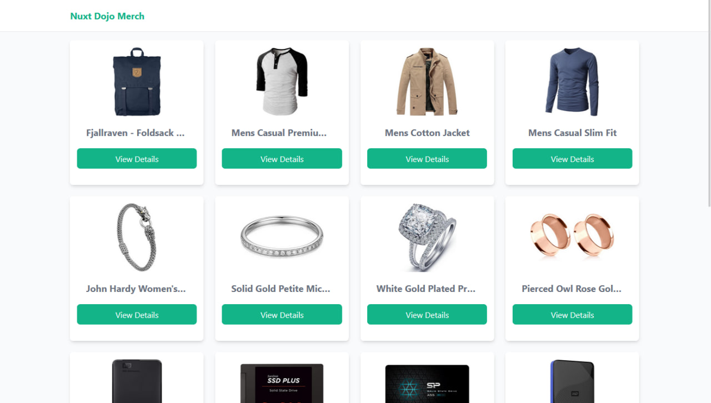
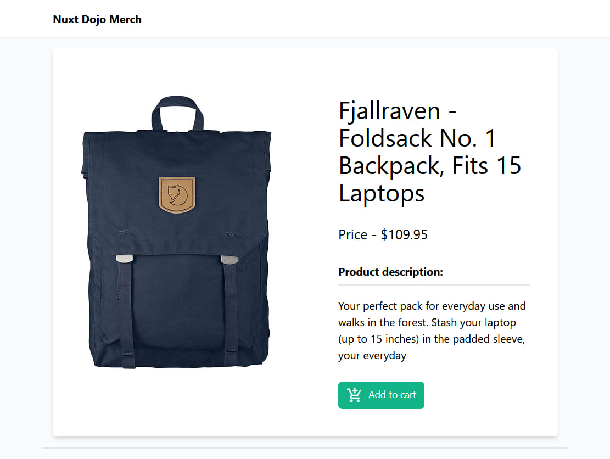

# Nuxt Dojo Merch
## Description

A website that simulates an e-commerce site for clothing items. It is implemented with Nuxt 3 and Tailwind CSS for styling. It implements a lot of the advantages of the Nuxt framework such as pages, route parameters, layouts, reusable components, error pages, server routes and much more. **I hope it will be helpful!**

## Design




## Build Setup

```bash
# install dependencies
$ npm install

# serve with hot reload at localhost:3000
$ npm run dev
```

## Contribution

To contribute to this project please check out the [contribution guidelines](https://github.com/YurisCodingClub/accessibility-mentor/blob/main/CONTRIBUTING.md).